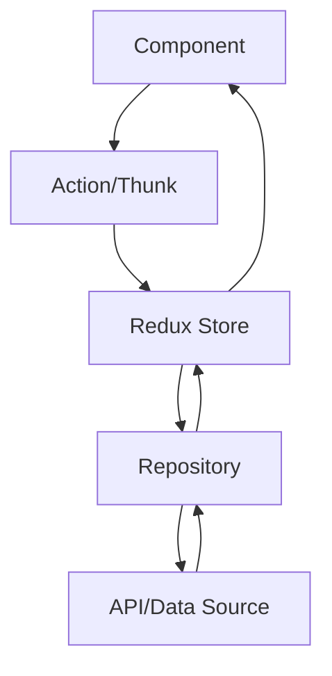

# Nota d'Arquitectura - OptimalWay

## 🏛️ Visió General de l'Arquitectura

L'aplicació OptimalWay està construïda seguint principis d'arquitectura moderna, escalabilitat i mantenibilitat. S'ha implementat una arquitectura basada en **features** que separa clarament les responsabilitats i facilita l'escalabilitat.

## 📐 Patrons Arquitectònics Implementats

### 1. **Feature-Based Architecture**

```
src/
├── features/           # Organització per funcionalitat
│   └── products/      # Feature de gestió de productes
├── components/        # Components reutilitzables
├── pages/            # Pàgines de l'aplicació
└── app/              # Configuració global
```

**Beneficis:**
- **Escalabilitat**: Fàcil afegir noves features sense afectar les existents
- **Mantenibilitat**: Cada feature és autònoma
- **Col·laboració**: Equips poden treballar en features independents

### 2. **Repository Pattern**

```javascript
// features/products/api/productsRepo.js
export const productsRepo = {
  getAll: async (filters) => { /* lògica d'accés a dades */ },
  getById: async (id) => { /* lògica d'accés a dades */ },
  create: async (data) => { /* lògica d'accés a dades */ },
  // ...
};
```

**Beneficis:**
- **Abstracció**: Separa la lògica de dades de la lògica de negoci
- **Testabilitat**: Fàcil mockar per testing
- **Flexibilitat**: Canviar font de dades sense afectar components

### 3. **Redux Toolkit Pattern**

```javascript
// features/products/productsSlice.js
export const productsSlice = createSlice({
  name: 'products',
  initialState: { /* estat inicial */ },
  reducers: { /* reducers síncrons */ },
  extraReducers: { /* maneig d'async thunks */ }
});
```

**Beneficis:**
- **Gestió d'Estat Centralitzada**: Estat previsible i debuggable
- **Async Operations**: Thunks per operacions asíncrones
- **DevTools**: Integració amb Redux DevTools

## 🧩 Separació de Capes

### **Capa de Presentació (UI)**
```
components/
├── ui/                 # Components genèrics
│   ├── modals/        # Modals reutilitzables
│   └── pagination/    # Component de paginació
├── products/          # Components específics
│   ├── productCard/   # Targeta de producte
│   ├── productForm/   # Formulari de producte
│   └── productDetailModal/ # Modal de detalls
└── layout/            # Components de layout
```

### **Capa de Lògica de Negoci**
```
features/products/
├── productsSlice.js   # Lògica d'estat i reducers
├── api/              # Accés a dades
└── constants/        # Constants de negoci
```

### **Capa de Dades**
```
features/products/
├── api/productsRepo.js    # Repository pattern
└── data/initialProductsDb.js # Dades inicials
```

### **Capa de Navegació**
```
app/
├── routes.jsx        # Definició de rutes
└── store.js         # Configuració global
```

## 🔄 Flux de Dades



### **Flux Detallat:**

1. **User Action** → Component dispara una acció
2. **Async Thunk** → Redux Toolkit gestiona l'operació asíncrona
3. **Repository** → Accés a dades abstracte
4. **State Update** → Redux actualitza l'estat
5. **UI Update** → Components es re-renderitzen

## 🎯 Components i Hooks Personalitzats

### **Components Reutilitzables**

#### ProductCard
```javascript
// Component encapsulat amb la seva lògica
export default function ProductCard({ product, onEdit, onDelete }) {
  // Lògica específica del component
}
```

#### ProductForm
```javascript
// Formulari reutilitzable per crear/editar
export default function ProductForm({ initialValues, onSubmit, submitting }) {
  // Validació, estat local, i lògica de formulari
}
```

### **Hooks Personalitzats (Potencials)**

```javascript
// hooks/useProducts.js
export const useProducts = () => {
  const dispatch = useDispatch();
  const { items, loading, error } = useSelector(state => state.products);
  
  const fetchProducts = useCallback((filters) => {
    dispatch(fetchProducts(filters));
  }, [dispatch]);
  
  return { items, loading, error, fetchProducts };
};
```

## 📊 Gestió d'Estat

### **Estructura de l'Estat**

```javascript
{
  products: {
    items: [],           // Llista de productes
    current: null,       // Producte actual (edit)
    loading: false,      // Estat de càrrega
    error: null,         // Errors
    filters: {           // Filtres actius
      search: '',
      category: ''
    },
    pagination: {        // Paginació
      page: 1,
      itemsPerPage: 12,
      total: 0
    }
  }
}
```

### **Async Thunks**

```javascript
// Operacions asíncrones gestionades per Redux Toolkit
export const fetchProducts = createAsyncThunk(
  'products/fetchProducts',
  async ({ filters, pagination }) => {
    return await productsRepo.getAll({ filters, pagination });
  }
);
```

## 🚀 Escalabilitat

### **Per Afegir Noves Features:**

1. **Crear nova carpeta a `features/`**
```
features/
├── products/     # Feature existent
├── users/        # Nova feature
└── orders/       # Nova feature
```

2. **Estructura estàndard per feature:**
```
features/users/
├── api/
│   └── usersRepo.js
├── constants/
│   └── userRoles.js
├── data/
│   └── initialUsers.js
└── usersSlice.js
```

3. **Afegir al store:**
```javascript
// app/store.js
export const store = configureStore({
  reducer: {
    products: productsReducer,
    users: usersReducer,    // Nova feature
    orders: ordersReducer,  // Nova feature
  },
});
```

### **Per Escalar Components:**

1. **Component Library**: Crear biblioteca de components reutilitzables
2. **Design System**: Establir tokens de disseny consistents
3. **Storybook**: Documentar components per reutilització

## 🔧 Configuració i Build

### **Vite Configuration**
```javascript
// vite.config.js
export default defineConfig({
  plugins: [react()],
  build: {
    rollupOptions: {
      output: {
        manualChunks: {
          vendor: ['react', 'react-dom'],
          redux: ['@reduxjs/toolkit', 'react-redux'],
          ui: ['@mui/material']
        }
      }
    }
  }
});
```

### **Code Splitting**
```javascript
// Lazy loading per pàgines
const ProductsListPage = lazy(() => import('./pages/ProductsListPage'));
const ProductEditPage = lazy(() => import('./pages/ProductEditPage'));
```

## 🧪 Testing Strategy

### **Estructura de Testing (Recomanada)**

```
src/
├── __tests__/
│   ├── components/
│   │   ├── ProductCard.test.jsx
│   │   └── ProductForm.test.jsx
│   ├── features/
│   │   └── products/
│   │       ├── productsSlice.test.js
│   │       └── productsRepo.test.js
│   └── pages/
│       └── ProductsListPage.test.jsx
```

### **Tipus de Tests**

1. **Unit Tests**: Components individuals
2. **Integration Tests**: Fluxos complets
3. **E2E Tests**: Cypress o Playwright

## 📈 Performance Optimizations

### **Implementades:**
- **Vite**: Build tool ràpid
- **Code Splitting**: Per rutes
- **CSS Variables**: Per consistència

### **Recomanades:**
- **React.memo()**: Per components pesats
- **useMemo/useCallback**: Per càlculs costosos
- **Virtual Scrolling**: Per llistes grans
- **Service Worker**: Per cache

## 🔒 Seguretat

### **Implementades:**
- **Input Validation**: Validació de formularis
- **XSS Protection**: React per defecte
- **CSRF**: Tokens en formularis

### **Recomanades:**
- **Authentication**: JWT tokens
- **Authorization**: Role-based access
- **HTTPS**: En producció
- **CSP Headers**: Content Security Policy

## 📱 Responsive Design

### **Breakpoints:**
```css
/* Mobile First */
@media (min-width: 768px) { /* Tablet */ }
@media (min-width: 1024px) { /* Desktop */ }
```

### **Grid System:**
```css
.grid {
  display: grid;
  grid-template-columns: repeat(auto-fill, minmax(200px, 1fr));
  gap: 16px;
}
```

## 🎨 Design System

### **Colors:**
```css
:root {
  --bg: #1e293b;        /* Background */
  --text: #e2e8f0;      /* Text */
  --primary: #3b82f6;   /* Primary */
  --danger: #ef4444;    /* Danger */
  --card: #111827;      /* Cards */
}
```

### **Typography:**
- Font system: `ui-sans-serif, system-ui`
- Consistent spacing: 8px base unit
- Responsive font sizes

## 🔮 Roadmap i Millores Futures

### **Curta Termini:**
1. **Testing Suite**: Vitest + Testing Library
2. **Error Boundaries**: Maneig d'errors global
3. **Loading States**: Skeletons en lloc de spinners

### **Mitjà Termini:**
1. **Authentication**: Sistema d'usuaris
2. **Real-time**: WebSockets per updates
3. **Offline Support**: Service Worker

### **Llarg Termini:**
1. **Micro-frontends**: Separació per features
2. **GraphQL**: API més eficient
3. **PWA**: Progressive Web App

## 📋 Conclusió

L'arquitectura implementada proporciona:

- ✅ **Escalabilitat**: Fàcil afegir noves features
- ✅ **Mantenibilitat**: Codi organitzat i documentat
- ✅ **Performance**: Optimitzacions modernes
- ✅ **Developer Experience**: Tools i patterns estàndard
- ✅ **User Experience**: UI/UX consistent i accessible

L'aplicació està preparada per escalar i afegir noves funcionalitats seguint els patrons establerts.
